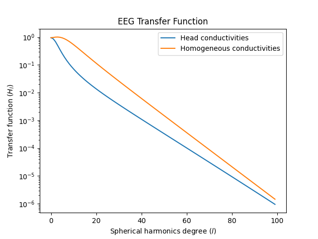

# What is the spatial resolution of EEG?

Everyone likes to say that EEG has low spatial resolution, but what is the resolution exactly?

I'm reproducing the figures in [An Information-Theoretic View of EEG Sensing](https://ieeexplore.ieee.org/document/7782724).

