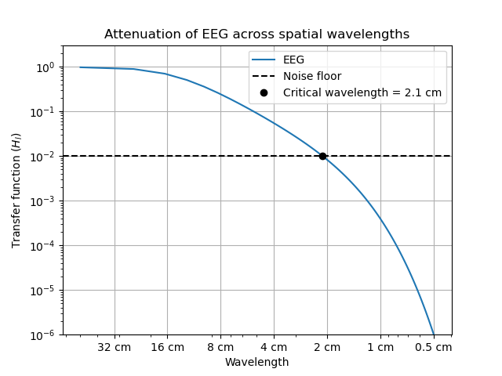
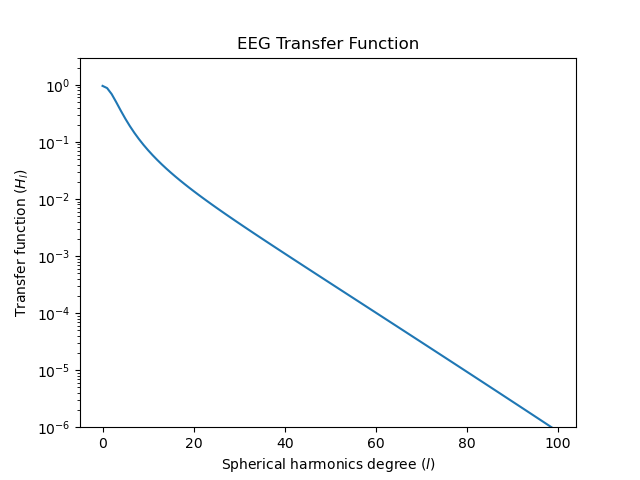

# What is the spatial resolution of EEG?

Everyone likes to say that EEG have low spatial resolution, but what is the resolution exactly?

I simulated the transfer function between the brain and the scalp for EEG, following the methods in [this paper](https://ieeexplore.ieee.org/document/7782724).

At signal-to-noise ratio (SNR) levels of 100 for EEG, wavelengths smaller than 2 cm drop below the noise floor.

See [`main.ipynb`](./main.ipynb) for the code to produce the figures.

## What does this plot mean?

In EEG, when neurons fire, sources of current in the brain give rise to a voltage distribution on the brain, $V_{\text{brain}}(\mathbf{r})$.

But EEG doesn't measure $V_{\text{brain}}(\mathbf{r})$ directly. Instead, since the electrodes are placed on the scalp and not the brain, it measures $V_{\text{scalp}}(\mathbf{r})$.

The paper, [An Information-Theoretic View of EEG Sensing](https://ieeexplore.ieee.org/document/7782724), describes a method for relating $V_{\text{brain}}(\mathbf{r})$ to $V_{\text{scalp}}(\mathbf{r})$. The paper assumes both the brain and scalp are spherical, and that there is a cerebral spinal fluid and skull layer between them. Each region is parameterized by a thickness and conductivity, $\sigma$.

You can decompose $V_{\text{scalp}}(\theta,\phi)$ and $V_{\text{brain}}(\theta,\phi)$ into spherical harmonics, $Y_{l,m}(\theta,\phi)$

$$V_{\text{brain}}(\theta,\phi) = \sum_{l=0}^{\infty} \sum_{m=-l}^{l} a_{l,m} Y_{l,m}(\theta,\phi)$$

$$V_{\text{scalp}}(\theta,\phi) = \sum_{l=0}^{\infty} \sum_{m=-l}^{l} b_{l,m} Y_{l,m}(\theta,\phi)$$

where $a_{l,m}$ and $b_{l,m}$ are the coefficients of the spherical harmonic expansion.

The result of the paper's calculations is that you can relate $a_{l,m}$ to $b_{l,m}$ via a transfer function, $H_{l,m}$.

$$a_{l,m} = H_{l,m}b_{l,m}$$

It turns out that $H_{l,m}$ is the same for all $m$ for a given $l$, so we write $H_{l}=H_{l,m}$. What's being plotted in the figures are $H_{l,m}$, which decreases exponentially in $l$.

Each harmonic number $l$ is associated to a wavelength

$$\lambda_{l} \approx \frac{2\pi R}{l}$$

where $R$ is the readius of the sphere.

## Reproduced figure

To make sure, I implemented the method correctly, I reproduced Fig 5 from [the paper](https://ieeexplore.ieee.org/document/7782724).

## Reference

P. Grover and P. Venkatesh, "An Information-Theoretic View of EEG Sensing," in Proceedings of the IEEE, vol. 105, no. 2, pp. 367-384, Feb. 2017, doi: 10.1109/JPROC.2016.2615179.
